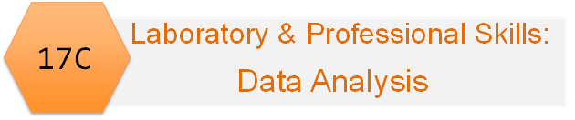
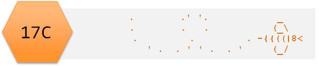

```{r setup, include=FALSE}
knitr::opts_chunk$set(echo = TRUE, 
                      message = FALSE,	
                      warning = FALSE,
                      fig.width=4, 
                      fig.height=4, 
                      fig.retina=3)
```

```{r include=FALSE}
library(tidyverse)
library(kableExtra)
library(RefManageR)
```

```{r, load-refs, include=FALSE, cache=FALSE}
BibOptions(check.entries = FALSE,
           bib.style = "authoryear",
           cite.style = "authoryear",
           style = "markdown",
           hyperlink = TRUE,
           dashed = FALSE,
           longnamesfirst = FALSE,
           max.names = 2)
myBib <- ReadBib("../refs/refs.bib", check = FALSE)
```


# Introduction

## Session overview

In this introduction you will start working with RStudio. You will typing in some data, perform some calculations on it and plot it.

## Learning Outcomes 

By actively following the materials and carrying out the independent study before and after the contact hours the successful student will be able to:

* to explain why we need statistical tests (MLO 1)
* use the R command line as a calculator and to assign variables (MLO 3)
* create and use the basic data types in R (MLO 3)
* find their way around the RStudio windows (MLO 3)
* create, use and save a script file to run r commands (MLO 3)
* search and understand manual pages (MLO 3)


## Philosophy

Workshops are not a test. It is expected that you often don't know how to start, make a lot of mistakes and need help.
Do not be put off and don't let what you can not do interfere with what you can do. You will benefit from collaborating with others and/or discussing your results.
It is expected that you are familiar with independent study content before the workshop. However, you need not remember or understand every detail as the workshop should build and consolidate your understanding. 
You may wish to refer to the independent study materials for reference.

## Key

These four symbols are used at the beginning of each instruction so you know where to carry out the instruction.

 is something you need to do on your computer. It may be opening programs or documents or locating a file. 

 is something you should do in RStudio. It will often be typing a command or using the menus but might also be creating folders, locating or moving files.  

 is something you should do in your browser on the internet. It may be searching for information, going to the VLE or downloading a file.  

 is question for you to think about an answer. You will usually want to record your answers in your script for future reference.  


# Getting started


 Start RStudio from the [Start menu](../pics/startmenu.png). 

My RStudio Anatomy may be a useful reference.

[](http://www-users.york.ac.uk/~er13/RStudio%20Anatomy.svg)

 Go the Files tab in the lower right pane and click on the [three dots on the right](../pics/three-dots.png). This will open a "Go to folder" window. Navigate to a place on your computer (or University account if using the VDS) where you keep your work. Click Open. 

 Also on the Files tab click on New Folder. In the box that appears type "data-analysis-in-r". This will be the folder that we work in throughout the Data Analysis in R part of 17C.

 Make an RStudio project for this workshop by clicking on the drop-down menu on top right where it says [Project: (None)](../pics/new-project.png) and choosing New Project and then New Directory.

 Make a [new script](../pics/newscript.png) then save it with a name like analysis.R to carry out the rest of the work. 


# Exercise

## The goal
We will work some data on the number of males in 64 bird nests with a clutch size of 5. You are going to type data in R, summarise and plot it

The data are as a frequency table:
```{r, echo=FALSE}
n <- c(0, 1, 2, 3, 4, 5)
freq <- c(4, 13, 14, 15, 13, 5)
df <- data.frame(n, freq)
knitr::kable(df, 
             format = "html",
             col.names = c("No. males", "No. nests"),
             row.names = FALSE) %>% 
  kable_styling()
```


You will create a figure like this:

```{r, echo=FALSE}
nest_data <- data.frame(n = factor(n), freq)
ggplot(data = nest_data, aes(x = n, y = freq)) +
  geom_col(colour = "black", fill = "white", width = 1) +
  scale_x_discrete(name = "Number of males",
                   expand = c(0, 0)) +
  scale_y_continuous(name = "Number of nests",
                     expand = c(0, 0)) +
  theme_classic()
```

## Creating the data

Start by making a vector `n` that holds the numbers 0 to 5. 

  Write the following in your script:
```{r}
# the number of males in a clutch of five
n <- 0:5
```

Remember, the shortcut for `<-` is ALT+-

Notice I have used a comment. Comment your code as much as possible!

  Ensure your cursor is on the line with the command and do CTRL+ENTER to send the command to the console to be executed.


 Examine the 'structure' of the `n` object using `str()`
```{r}
str(n)
```

It's vector of 6 integers.

 Create a vector called `freq` containing the numbers of nests with 0 to 5 males and examine it with `str()`.
```{r include=FALSE}
#---CODING ANSWER---
## the number of nests with 0 to 5 males
freq <- c(4, 13, 14, 15, 13, 5)
str(freq)
```

 Check `sum(freq)` gives the answer you expect:
```{r}
# the total number of nests
sum(freq)
```

## Finding the mean

We have frequencies so to find the mean number of males per nest we need the total number of males:

```{r , echo=FALSE}
df$product <- df$n * df$freq
totalm <- sum(df$product)
totaln <- sum(df$freq)
dfchar <- df %>%
  mutate_all(as.character)
dfchar <- rbind(dfchar, c("Total", totaln, totalm))
dfchar %>% kable(format = "html",
                 col.names = c("No. males", "No. nests", "No. males *No. nests"),
                 row.names = FALSE) %>% 
  kable_styling(font_size = 16) %>%
  row_spec(6, hline_after = TRUE) %>%
  row_spec(7, bold = TRUE, background = "#C0C2C9")
```
So the mean is: $$\frac{163}{64} = 2.55$$

Let us do this in R.

 Calculate the total number of nests:
```{r}
total_nests <- sum(freq)
```

Notice we have assigned the value to a variable that we will be able to use later.

 Calculate the total number of males
```{r}
total_males <- sum(n * freq)
```


 Calculate the the mean number of males per nest:
```{r}
total_males/total_nests
```

### Why it works

R works 'elementwise' unlike most programming languages.  

` n * freq` gives

$$\begin{bmatrix}0\\1\\2\\3\\4\\5\end{bmatrix}\times\begin{bmatrix}4\\13\\14\\15\\13\\5\end{bmatrix}=\begin{bmatrix}0\\13\\28\\45\\52\\25\end{bmatrix}$$

It was designed to make it easy to work with data.


## Plotting the data with `ggplot()`

Commands like `c()`, `sum()`, and `str()` are part the 'base' R system.

Base packages (collections of commands) always come with R. 

Other packages, such as `ggplot2` `r Cite(myBib, "ggplot2")` need to be added. 
`ggplot2` is one of the `tidyverse` `r Cite(myBib, "tidyverse")` packages.

Added packages need only be installed once but must be loaded each R session.

If you are working on your own computer or using RStudio cloud you will need to install `tidyverse`. If you are working on the VDS you do **not** need to install it.

To install a package:  
 Go the Packages tab on the lower right pane. Click Install and type `tidyverse` into the box that appears. 

Wait until you get the prompt back. It will take a few moments, be patient!

To load a package which you have already installed we use the `library()` function.

 Load the `tidyverse`:
```{r}
library(tidyverse)
```

You will likely be warned of some function name conflicts but these will not be a problem for you.

`ggplot()` takes a dataframe for an argument

We can make a dataframe of the two vectors, `n` and `freq` usinf the `data.frame()` function.

 Make a dataframe called `nest_data`
```{r}
nest_data <- data.frame(n = factor(n), freq)
```

`n` was made into a factor (a categorical variable).

 Check the structure of `nest_data`
```{r include=FALSE}
str(nest_data)
```

Click on `nest_data` in the Environment to open a spreadsheet-like view of it.


## A barplot

 Create a simple barplot using `ggplot` like this:

```{r, fig.height=3.5}
ggplot(data = nest_data, aes(x = n, y = freq)) +
  geom_col()
```

`ggplot()` alone creates a blank plot. 

`ggplot(data = nest_data)` looks the same. 

`aes()` gives the 'Aesthetic mappings'. How variables (columns) are mapped to visual properties (aesthetics) e.g., axes, colour, shapes.

Thus...

`ggplot(data = nest_data, aes(x = n, y = freq))` produces a plot with axes 

`geom_col` A 'Geom' (Geometric object) gives the visual representations of the data: points, lines, bars, boxplots etc.

Note that `ggplot2` is the name of the package and `ggplot()` is its most important command.

## Using the help manual

'Arguments' can be added to the `geom_col()` command inside the brackets.  

Commands do something and their arguments (in brackets) and can specify:
* what object to do it to  
* how exactly to do it  

Many arguments have defaults so you don't always need to supply them.

 Open the manual page for `geom_col()` using:
```{r eval=FALSE}
?geom_col
```

The manual page has several sections.

* **Description** an overview of what the command does  
* **Usage** lists argument    
  * form: argument name = default value  
  * some arguments MUST be supplied others have defaults
  * `...` means etc and includes arguments that can be passed to many 'geoms'
* **Arguments** gives the detail about the arguments 
* **Details** describes how the command works in more detail  
* **Value** gives the output of the command 
* Don't be too perturbed by not fully understanding the information

## Customising the plot

 Change the fill of the bars using `fill`:
```{r plot-last1, fig.show = 'hide'}
ggplot(data = nest_data, aes(x = n, y = freq)) +
  geom_col(fill = "lightblue")
```


Colours can be given by their name, "lightblue" or code, "#ADD8E6".  

Look up by [name](../pics/colournames.pdf) or [code](../pics/colourhex.pdf)

 Change the bars to a colour you like.

`fill` is one of the arguments covered by `...`. `fill` is an 'aesthetic'. If you look for `...` in the list of arguments you will see it says:

> Other arguments passed on to layer(). These are often aesthetics, used to set an aesthetic to a fixed value, like colour = "red" or size = 3. They may also be parameters to the paired geom/stat.

Further down the manual, there is a section on **Aesthetics** which lists those understood by `geom_col()`

We can set (map) the `fill` aesthetic to a particular colour inside `geom_col()` or map it to a variable inside the `aes()` instead.

 Map the `fill` aesthetic to the `n` variable:
```{r}
ggplot(data = nest_data, aes(x = n, y = freq, fill = n)) +
  geom_col()
```

Mapping `fill` to a variable means the colour varies for each value of `n`. 


 Use the manual to put the bars next to each other. Look for the argument that will mean there is no space between the bars.

```{r echo=FALSE}
ggplot(data = nest_data, aes(x = n, y = freq)) +
  geom_col(fill = "lightblue", width = 1)
```


 Use the manual to change the colour of the lines around each bar to black.

```{r echo=FALSE}
ggplot(data = nest_data,
       aes(x = n, y = freq)) +
  geom_col(fill = "lightblue", 
           width = 1, 
           colour = "black")
```


<div class = "key">

**Top Tip**

Make your code easier to read by using white space and new lines  

* put spaces around `=` , `->` and after `,`  
* use a newline after every comma in a command with lots of arguments 
</div>

We can make changes to the axes using:

* Changes to a discrete x axis: `scale_x_discrete()`
* Changes to a continuous y axis: `scale_y_continuous()`

`ggplot` automatically extends the axes slightly. You can turn this behaviour off with the `expand` argument in `scale_x_discrete()` and `scale_y_continuous()`.

 Remove the gap betweenthe axes and the data:
```{r}
ggplot(data = nest_data, aes(x = n, y = freq)) +
  geom_col(fill = "lightblue", 
           width = 1, 
           colour = "black") +
  scale_x_discrete(expand = c(0, 0)) + #<<
  scale_y_continuous(expand = c(0, 0)) #<<
```

Each 'layer' is added to the ggplot() command with a `+`

 Look up `scale_x_discrete` in the manual and work out how to change the axis title from "n" to "Number of Males". 

```{r echo=FALSE}
ggplot(data = nest_data, aes(x = n, y = freq)) +
  geom_col(fill = "lightblue", 
           width = 1, 
           colour = "black") +
  scale_x_discrete(expand = c(0, 0),
                   name = "Number of Males") + #<<
  scale_y_continuous(expand = c(0, 0),
                     name = "Number of Nests") 


```

 You're finished!

# `r emo::ji("party")` Well Done! `r emo::ji("party")`


# Independent study following the workshop

Please note that next week's work assumes you have carried out the independent study.

1. Read [1.1 On the psychology of statistics section](https://learningstatisticswithr.com/book/why-do-we-learn-statistics.html#whywhywhy) from Dani Navarro's Learning statistics with R. It is the first part of Chapter 1 Why do we learn statistics? Approx 5 minutes.

2.  Watch [Getting help in RStudio](https://youtu.be/tVQHFuitFJw) which explains how to bring up the manual pages and understand them. Getting help in RStudio. Being able to use the manual is a **threshold concept** in R. You will get a feel for the structure and pattern of commands much more quickly if you make a habit of briefly reading the manual for the commands you are using. 


# The Code files

These contain all the code needed in the workshop even where it is not visible on the webpage.

[Rmd file](01IntroductionToModuleAndRStudio.Rmd)
The Rmd file is the file I use to compile the practical. Rmd stands for R markdown. It allows R code and ordinary text to be interweaved to produce well-formatted reports including webpages. If you right-click on the link and choose Save-As, you will be able to open the Rmd file in RStudio. Alternatively, [View in Browser](https://github.com/3mmaRand/BIO00017C-Data-Analysis-in-R-2020/blob/main/workshops/01IntroductionToModuleAndRStudio.Rmd).

[Plain script file](../scripts/01IntroductionToModuleAndRStudio.R)
This is plain script (.R) version of the practical generated from the Rmd. Again, you can save this and open it RStudio.
Alternatively, [View in Browser](https://github.com/3mmaRand/BIO00017C-Data-Analysis-in-R-2020/blob/main/scripts/01IntroductionToModuleAndRStudio.R).


Pages made with `rmarkdown` `r Cite(myBib, c("markdown1","markdown2"))`, `kableExtra``r Cite(myBib, "kableExtra")`, `RefManager``r Cite(myBib, "RefManager")` 

# References 

```{r refs, echo=FALSE, results="asis"}
PrintBibliography(myBib)  
```


