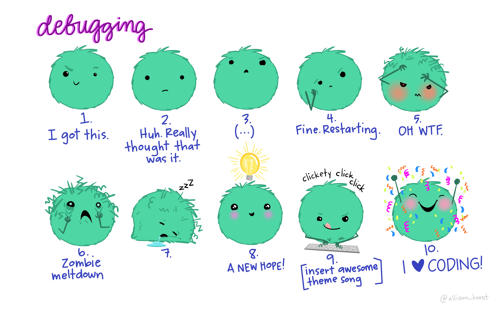

[](https://doi.org/10.5281/zenodo.6359475)
Emma Rand. (2022). Data Analysis in R (BIO00017C) 2020: 2022 (v1.1). Zenodo. https://doi.org/10.5281/zenodo.6359475


```{r setup, include=FALSE}
knitr::opts_chunk$set(echo = TRUE, 
                      message = FALSE,	
                      warning = FALSE,
                      fig.width = 4, 
                      fig.height = 4, 
                      fig.retina = 3)
```

```{r include=FALSE}
library(tidyverse)
library(kableExtra)
library(RefManageR)
```

```{r, load-refs, include=FALSE, cache=FALSE}
BibOptions(check.entries = FALSE,
           bib.style = "authoryear",
           cite.style = "authoryear",
           style = "markdown",
           hyperlink = TRUE,
           dashed = FALSE,
           longnamesfirst = FALSE,
           max.names = 2)
myBib <- ReadBib("../refs/refs.bib", check = FALSE)
```

# Introduction

## Session overview

In this workshop you will get practice in choosing between, performing, and presenting the results of one-way ANOVA and Kruskal-Wallis in R.
 
## Learning Outcomes

By actively following the materials and carrying out the independent study before and after the contact hours the successful student will be able to:

-   Explain the rationale behind ANOVA (MLO 1 and 2)
-   Know the relationship between the sums of squares ($SS$), the mean squares ($MS$) and the $F$ value
-   Select, appropriately,one-way ANOVA and Kruskal-Wallis  including post-hoc tests (MLO 2)
-   Apply and interpret the tests in R (MLO 3 and 4)
-   Evaluate whether the assumptions of a test are met
-   Summarise and illustrate with appropriate R figures test results scientifically (MLO 3 and 4)

## Philosophy

Workshops are not a test. It is expected that you often don't know how to start, make a lot of mistakes and need help. Do not be put off and don't let what you can not do interfere with what you can do. You will benefit from collaborating with others and/or discussing your results. It is expected that you are familiar with independent study content before the workshop. However, you need not remember or understand every detail as the workshop should build and consolidate your understanding. You may wish to refer to the independent study materials for reference.

Materials are indexed here: <https://3mmarand.github.io/BIO00017C-Data-Analysis-in-R-2020/>

## Key

These four symbols are used at the beginning of each instruction so you know where to carry out the instruction.

 is something you need to do on your computer. It may be opening programs or documents or locating a file.

 is something you should do in RStudio. It will often be typing a command or using the menus but might also be creating folders, locating or moving files.

 is something you should do in your browser on the internet. It may be searching for information, going to the VLE or downloading a file.

 is question for you to think about an answer. You will usually want to record your answers in your script for future reference.



# Getting started


 Start RStudio from the [Start menu](../pics/startmenu.png).

 Make an RStudio project for this workshop by clicking on the drop-down menu on top right where it says [Project: (None)](../pics/new-project.png) and choosing New Project and then New Directory, then New Project. Navigate to the "data-analysis-in-r" folder. Name the RStudio Project 'workshop5'.

 On the Files tab click on New Folder. In the box that appears type "data". This will be the folder that we save data files to.

 Make a [new script](../pics/newscript.png) then save it with a name like analysis.R to carry out the rest of the work.

 Load the `tidyverse`:

```{r}
library(tidyverse)
```

# Exercises

## Myoglobin in seal muscle 

The myoglobin concentration of skeletal muscle of three species of seal in grams per kilogram of muscle was determined and the data are given in [seal.csv](../data/seal.csv). We want to know if there is a difference between species.  Each row represents an individual seal. The first column gives the myoglobin concentration and the second column indicates species. 

 Save a copy of the data file [seal.csv](../data/seal.csv)

 Compare [seal.csv](../data/seal.csv) and [adipocytes.txt](../data/adipocytes.txt) by opening the file. You can do this in RStudio by clicking on the files in the files window.

 How do the data files differ? How might this influence your data import?

<!-- THINKING ANSWER 
the adipocytes data file uses white space to separate - or delimit - the values. This is what read_table() expects. See the manual for read_table(). the seal data are in a comma separated values (csv) file and one of the columns contains value that have a space. Using read_table() will run but the resulting dataframe won't be quite what you want. There will be a message saying two columns were expected but three were included. Two are expected because there only two words and one space on the first row. The myoglobin values won't be in the second column called myoglobin but instead the second word for the first column, Seal, is there. We can use read_csv() instead
-->

 Read in the data and check the structure. I used the name `seal` for the dataframe/tibble. What kind of variables do you have?
```{r, eval=FALSE, echo=FALSE}
#---CODING ANSWER---
# import
seal  <-  read_csv("data/seal.csv")
str(seal)
```

<!-- THINKING ANSWER 
we have a categorical variable with three groups and a continuous variable which is the response.
-->

```{r, include=FALSE}
# importing for emma
# my directory structure differs
seal  <-  read_csv("../data/seal.csv", )
str(seal)
```

### Exploring

 Do a quick plot of the data.You may need to refer to a previous workshop
```{r, include=FALSE}
ggplot(data = seal, aes(x = species, y = myoglobin)) +
  geom_violin()
```
### Summarising the data

Do you remember this **Top Tip**?

<div class = "key">

**Top Tip**

The code required to summarise, and plot data for any two-sample *t*-test AND for any for any one-way ANOVA is **exactly the same** except for the names of the dataframe, variables and the axis labels and limits.
Take some time to comment it. Consider making a script called ttest.R or similar with all the code and information you need to reuse it.

</div>

 If you followed that tip you'll be able to open that script and whizz through summarising and plotting. Whether you did or did not, why not make a one-way-ANOVA.R script to help future you.

 Create a data frame called `sealsummary` that contains the means, standard deviations, sample sizes and standard errors for each species. You may want to look this up in your scripts from the previous workshops.
```{r echo = FALSE}
#---CODING ANSWER---
sealsummary <- seal %>%
  group_by(species) %>%
  summarise(mean = mean(myoglobin),
            std = sd(myoglobin),
            n = length(myoglobin),
            se = std/sqrt(n))

```
You should get the following numbers:

```{r echo=FALSE}
knitr::kable(sealsummary) %>% kableExtra::kable_styling()
```

### Applying, interpreting and reporting

We can now carry out a one-way ANOVA. When doing an ANOVA it is common to assign the result of the `aov()` procedure to a variable, then examine it using `summary()`

 Carry out an ANOVA and examine the results with:
```{r anovatest}
mod <- aov(data = seal, myoglobin ~ species)
summary(mod)
```

Remember: the tilde (`~`) means test the values in `myoglobin` when grouped by the values in `species.` Or explain `myoglobin` with `species`

 What do you conclude so far from the test? Write your conclusion in a form suitable for a report. 
<!--
#---THINKING ANSWER---
There is a significant difference in myoglobin concentration between Seal species (ANOVA: F = 5.35; d.f. = 2, 87; p = 0.006).
-->

The ANOVA is significant but which means differ? We need a post-hoc test. A post-hoc ("after this") test is done after (and only after) a significant ANOVA test. The ANOVA tells you at least two of means differ, the post-hoc test tells you where the differences are. There are several possible post-hoc tests. A popular option is the Tukey Honest Significant Difference test.

 Carry out a Tukey HSD with:

```{r}
TukeyHSD(mod)
```

Each row is a comparison between means. The 'diff' column is the difference between the means the 'p adj' column indicates whether that difference is significant.

A plot can be used to visualise the result of the post hoc and make it easier to understand

 Use the generic `plot()` function to plot the post-hoc:
```{r fig.height=5}
TukeyHSD(mod) %>% plot(cex.axis = 0.7)   # cex.axis just changes the size of the axis labels
```

You may want to . This shows the confidence intervals on the differences between the means and the dashed vertical line is at zero so if the confidence interval crosses that line (*i.e.*, the C.I. includes zero) then the means do not differ significantly.

 What do you conclude from the test?  
<!--
#---THINKING ANSWER---
The significant difference lies between Harbour and Bladdernose.
-->


### Check assumptions

We need to examine the residuals. Unlike with `t.test` we don't have to calculate them - the object which is created by `aov()` contains a variable called `$residuals`.

Also conveniently, the R's `plot()` function can used on the output objects of `aov()` 

 Plot the model residuals against the fitted values like this:
```{r}
plot(mod, which = 1)
```

The group means are the fitted (or predicted) values; each residual is the difference between the mean and the actual value.

 What to you conclude?
<!--
#---THINKING ANSWER---
the residuals look homogeneously distributed
-->


 To examine normality of the model residuals we can do a histogram 
```{r}
hist(mod$residuals)
```

 Use the `shapiro.test()` on the model residuals
```{r include=FALSE}
shapiro.test(mod$residuals)
```

 What to you conclude?
<!--
#---THINKING ANSWER---
the residuals normally distributed. The histogram is roughly normal - it's symmetrical - and the shapiro test is NS.

Overall, it seems the assumptions are met
-->-


### Illustrating

We will produce a figure to go with a significant ANOVA in a report using `ggplot2`.

Look at the figure we did in the [last practical](04OneAndTwoSampleTests.html#illustrating) for adiponectin concentration of control and nicotinic acid treated adipocytes. 

Notice how the fundamental structure of the plot is the same as we require here, there is just a different number of groups. 

We will again use both our `seal` and `sealsummary` dataframes.


 Create the plot:   
```{r fig.width = 5, fig.height = 5}
ggplot() +
  geom_point(data = seal, aes(x = species, y = myoglobin),
             position = position_jitter(width = 0.1, height = 0),
             colour = "gray50") +
  geom_errorbar(data = sealsummary, 
                aes(x = species, ymin = mean - se, ymax = mean + se),
                width = 0.3) +
  geom_errorbar(data = sealsummary, 
                aes(x = species, ymin = mean, ymax = mean),
                width = 0.2) +
  scale_y_continuous(name = expression(Myoglobin~concentration~g~Kg^{-1}),
                     limits = c(0, 80), 
                     expand = c(0, 0)) +
  scale_x_discrete(labels = c("Bladdernose", "Harbour", "Weddell"), 
                   name = "Seal Species") +
  theme_classic()
```
   
Notice the use of `expression()` to allow you to specify special characters. `expression()` takes strings or [LaTeX](https://en.wikipedia.org/wiki/LaTeX) formatting. Each string or piece of LaTeX is separated by a `*` or a `~`. The `*` puts them together without a space, and `~` with a space. `Kg^{-1}`makes the -1 a superscript. 

This figure is good .... but it would be nice to show the result of the post-hoc test by annotating the figure. 

We can add annotation to a `ggplot` using `annotate()`

 Look up  `annotate()` in the manual:
```{r eval=FALSE}
?annotate
```

The examples section might be useful to aid understanding. `annotate()` takes a `geom` as its first argument. This can be `text` `segment` `rect` etc. The other arguments are positioning aesthetics which say where the annotation should be placed. 
We need three segments: two short vertical lines and one long horizontal line. We also need one piece of text to give the $p$ value.

 Add the annotations to the plot: 
```{r fig.width = 4, fig.height = 4}
ggplot() +
  geom_point(data = seal, aes(x = species, y = myoglobin),
             position = position_jitter(width = 0.1, height = 0),
             colour = "gray50") +
  geom_errorbar(data = sealsummary, 
                aes(x = species, ymin = mean - se, ymax = mean + se),
                width = 0.3) +
  geom_errorbar(data = sealsummary, 
                aes(x = species, ymin = mean, ymax = mean),
                width = 0.2) +
  scale_y_continuous(name = expression(Myoglobin~concentration~g~Kg^{-1}),
                     limits = c(0, 80), 
                     expand = c(0, 0)) +
  scale_x_discrete(labels = c("Bladdernose", "Harbour", "Weddell"), 
                   name = "Seal Species") +
  # long horizontal. goes from bladdernose (x = 1) to harbour (xend = 2) 
  # the y and yend are the same
  annotate("segment", x = 1, xend = 2,   
           y = 72, yend = 72, 
           colour = "black") +
  # short horizontal, x and xend are the same at harbour (xend = 2)
  # y and yend are slightly apart
  annotate("segment", x = 2, xend = 2, 
           y = 72, yend = 70,
           colour = "black") +
  # short horizontal, x and xend are the same at bladdernose (x = 1)
  # y and yend are slightly apart
  annotate("segment", x = 1, xend = 1,
           y = 72, yend = 70,
           colour = "black") +
  # the text
  annotate("text", x = 1.5,  y = 75,
           label = expression(italic(p)~"= 0.005")) +
  theme_classic()
```  
<div class = "key">

**Top Tip**

Use comments anywhere in the `ggplot` block to help you remember what each part does. I find this especially useful for labelled the annotations.

</div>


 Make a new folder called 'figures' and write your figure to file. This will allow you to check your understanding of paths.
```{r echo = FALSE}
#---CODING ANSWER---
ggsave("figures/seal.png",
       width = 5,
       height = 4,
       units = "in")
```


## Leafminers on Birch

Larvae of the Ambermarked birch leafminer, *Profenusa thomsoni*, feed on the interior leaf tissues of Birch (Betula) species. They do not normally kill the tree but can weaken it making it susceptible to attack from other species. Researchers are interested in whether there is a difference in the rates at which white, grey and yellow birch are attacked. They introduce adult female *P.thomsoni* to a green house containing 30 young trees (ten of each type) and later count the egg laying events on each tree. The data are in [leaf.txt](../data/leaf.txt).

### Exploring

 Read in the data and check the structure. I used the name `leaf` for the dataframe/tibble. What kind of variables do you have?
```{r, eval=FALSE, echo=FALSE}
#---CODING ANSWER---
# import
leaf  <-  read_table("data/leaf.txt")
str(leaf)
```

<!-- we have birch, a categorical variable with three groups, and counts in eggs  which is the response. counts are numeric bit discrete.-->

```{r, include=FALSE}
# importing for emma
# my directory structure differs
leaf  <-  read_table("../data/leaf.txt")
str(leaf)
```

 Do a quick plot of the data.You may need to refer to a previous workshop
```{r, include=FALSE}
ggplot(data = leaf, aes(x = birch, y = eggs)) +
  geom_boxplot()
```


 Using your common sense, do these data look normally distributed? 
<!--
#---THINKING ANSWER---
No and little need to test - they're counts, and have unequal variances
-->

 Why is a Kruskal-Wallis appropriate in this case?
<!--
#---THINKING ANSWER---
the data are counts hence they are not continuous. We can sometimes treat count data as continuous if there is a large number of possible values and the distance between each value relative to the range is small but this is not the case here. In addition there are only ten values in each group 
-->


 Calculate the medians, means and sample sizes. 
```{r include=FALSE}
#---CODING ANSWER---
leaf %>% 
  group_by(birch) %>% 
  summarise(mean = mean(eggs),
            median = median(eggs),
            n = length(eggs))
```

### Applying, interpreting and reporting


 Carry out a Kruskal-Wallis:
```{r}
kruskal.test(data = leaf, eggs ~ birch)
```

 What do you conclude from the test? 
<!--
#---THINKING ANSWER---
There is a significant difference between birch types in the number of laying events by *P.thomsoni* 
-->

The significant Kruskal-Wallis tells us at least two of the groups differ but where do the differences lie? A post-hoc multiple comparison test for a significant Kruskal-Wallis exists in the pgirmess package.

 Load the package using `library()`
```{r include=FALSE}
#---CODING ANSWER---
library(pgirmess)
```

 Run the post-hoc test with:
```{r}
kruskalmc(data = leaf, eggs ~ birch)
```

The `obs.diff` column gives the mean rank for each group, `critical.dif` is how big the difference between the means ranks must be for significance at the 0.05 level (by default) and the final column tells you if the `obs.diff` is greater than the `critical.dif`.


<div class = "key">
**Top Tip**

You can use the `probs` argument to change the signifcance value the `kruskalmc()` test uses and by iteration, get a $p$ value, for example:
`kruskalmc(data = leaf, eggs ~ birch, probs = 0.04)`
`kruskalmc(data = leaf, eggs ~ birch, probs = 0.03)`
</div>


 What do you conclude from the test? 
   <!--
#---THINKING ANSWER---
The significant difference is between yellow birch and white birch (the highest and lowest number of eggs)
-->

 Write up the result is a form suitable for a report.
<!-- There is a significant difference in the rate of leafminer attack between birch species (Kruskal-Wallis: chi-squared = 6.34, df = 2, p-value = 0.042). Post-hoc testing revealed that difference to be between the White Birch with the lowest number of eggs (median = 14) and Yellow Birch with the highest (median = 54). -->

### Illustrating

 A box plot is an appropriate choice for illustrating a Kruskal-Wallis. Can you produce a figure like this?

<div class = "key">

**Top Tip**

Look at your script for [last practical](04OneAndTwoSampleTests.html#Illustrating17) for the plot we did for the grouse data.

</div>

```{r echo = FALSE, fig.width = 5, fig.height = 5}
#---CODING ANSWER---
ggplot(leaf, aes(x = birch, y = eggs) ) +
  geom_boxplot() +
  scale_x_discrete(name = "Birch") +
  scale_y_continuous(name = "Number of eggs", 
                     limits = c(0, 110),
                     expand = c(0, 0)) +
  annotate("segment", x = 2, xend = 3, 
           y = 100, yend = 100,
           colour = "black") +
  annotate("segment", x = 2, xend = 2, 
           y = 100, yend = 97,
           colour = "black") +
  annotate("segment", x = 3, xend = 3, 
           y = 100, yend = 97,
           colour = "black") +
  annotate("text", x = 2.5,  y = 104, 
           label = expression(italic(p)~"= 0.036")) +
  theme_classic()
```

# `r emo::ji("party")` Well Done! `r emo::ji("party")`

# Independent study following the workshop

Decide which test you should use to analyse the each following data sets. In each case give the reasons for your choice of test and state the null hypothesis. Write your conclusions in a form suitable for including in a report. Can you make figures?

## 1. Effects of fitness and heat acclimatisation
Sports scientists were investigating the effects of fitness and heat acclimatisation on the sodium content of sweat. They measured the sodium content of the sweat ($\mu mol\mspace{3mu}l^{-1}$) of three groups of individuals: unfit and unacclimatised (UU); fit and unacclimatised(FU); and fit and acclimatised (FA). The are in [sweat.txt](../data/sweat.txt). Is there a difference between the groups in the sodium content of their sweat?
   
   
```{r include=FALSE}
#read in the data and look at structure
sweat <- read_table("../data/sweat.txt")
str(sweat)

# quick plot of the data
ggplot(data = sweat, aes(x = gp, y = na)) +
  geom_boxplot()

# Since the sample sizes are small and not the same in each group and the 
# variance in the FA gp looks a bit lower, I'm leaning to a non-parametric test K-W.
# However, don't panic if you decided to do an anova

# calculate some summary stats 
sweatsum <- sweat %>% 
  group_by(gp) %>% 
  summarise(mean = mean(na),
            n = length(na),
            median = median(na))


# Kruskal-Wallis
kruskal.test(data = sweat, na ~ gp)
# We can say there is a difference between the groups in the sodium 
# content of their sweat (chi-squared = 11.9802, df = 2, p-value = 0.002503).
# Unfit and unacclimatised people have most salty sweat, 
# Fit and acclimatised people the least salty.

# a post-hoc test to see where the sig differences lie:

kruskalmc(data = sweat, na ~ gp)
# Fit and acclimatised people (FA) have significantly less sodium in their
#  sweat than the unfit and unacclimatised people (UU). 
# Fit and unacclimatised (FU) people have sodium concentrations 
# more similar to the FA group but don't reach significance 
# for being different to UU. See figure 1.

# this was my process for closing down on a p value..kruskalmc(data = sweat, na ~ gp, probs = 0.0027)
kruskalmc(data = sweat, na ~ gp, probs = 0.01) #sig so must be smaller
kruskalmc(data = sweat, na ~ gp, probs = 0.005) #sig so must be smaller
kruskalmc(data = sweat, na ~ gp, probs = 0.0025) # not sig so must be bigger
kruskalmc(data = sweat, na ~ gp, probs = 0.0026) # not sig so must be bigger
kruskalmc(data = sweat, na ~ gp, probs = 0.0027) # that's enough d.p

ggplot(sweat, aes(x = gp, y = na) ) +
  geom_boxplot() +
  ylab(expression("Sodium"*mu*"mol"*l^{-1})) +
  scale_x_discrete(labels = c("Fit Acclimatised", 
                              "Fit Unacclimatised", 
                              "Unfit Unacclimatised"), 
                   name = "Group") +
  scale_y_continuous(limits = c(0, 100)) +
  annotate("segment", x = 1, xend = 3, 
           y = 90, yend = 90,
           colour = "black") +
  annotate("segment", x = 1, xend = 1, 
           y = 90, yend = 87,
           colour = "black") +
  annotate("segment", x = 3, xend = 3, 
           y = 90, yend = 87,
           colour = "black") +
  annotate("text", x = 2,  y = 93, 
           label = expression(italic(p)~"= 0.0027")) +
  theme_classic()

#Figure 1. Sodium content of sweat for three groups: Fit and acclimatised
#(FA), Fit and unacclimatised (FU) and Unfit and unacclimatised (UU). Heavy lines
#indicate the median, boxes the interquartile range and whiskers the range. 

   
```

## 2. Insecticide effectiveness
The data are given in [biomass.txt](../data/biomass.txt) are taken from an experiment in which the insect pest biomass (g) was measured on plots sprayed with water (control) or one of five different insecticides. Do the insecticides vary in their effectiveness? What advice would you give to a person:
 - currently using insecticide E?
 - trying to choose between A and D?
 - trying to choose between C and B?
   
```{r include=FALSE}
#---CODING AND THINKING ANSWER---
######################################################################
#                                                                    #
#   A comparison of the effects of five insect pesticides on the     #
#   insect biomass in treated plots.                                 #
#                                                                    #     
######################################################################

######################################################################
#                             Introduction                           #
######################################################################

# The data are given in biomass.txt are taken from an experiment 
# in which the insect pest biomass (g) was measured on plots sprayed 
# with water (control) or one of five different insecticides. 
# The goal of the analysis was to determine if the insecticides 
# vary in their effectiveness and specifically advise on:
#   - use of insecticide E
#   - the choice between A and D
#   - the choice between C and B

# The data are organised with an insecticide treatment group in
# each column:
# 'data.frame':	10 obs. of  6 variables:
# $ WaterControl: num  350 324 359 255 208 ...
# $ A           : num  159 146 116 135 137 ...
# $ B           : num  150.1 154.4 69.5 150.7 212.6 ...
# $ C           : num  80 266.4 161.2 161.4 51.2 ...
# $ D           : num  267 110 221 160 198 ...
# $ E           : num  350 320 359 255 208 ...

######################################################################
#                       Import and tidy data                         #
######################################################################

# data are in ../data
biom <- read_table("../data/biomass.txt")

# check structure
str(biom)

# 'data.frame':	10 obs. of  6 variables:
# $ WaterControl: num  350 324 359 255 208 ...
# $ A           : num  159 146 116 135 137 ...
# $ B           : num  150.1 154.4 69.5 150.7 212.6 ...
# $ C           : num  80 266.4 161.2 161.4 51.2 ...
# $ D           : num  267 110 221 160 198 ...
# $ E           : num  350 320 359 255 208 ...

# The data are organised with an insecticide treatment group in
# each column. Put the data into tidy format.

biom <- biom %>% pivot_longer(cols = everything(),
                              names_to = "spray",
                              values_to = "biomass")

######################################################################
#                     Exploratory Analysis                           #
######################################################################

# quick plot of the data
ggplot(data = biom, aes(x = spray, y = biomass)) +
  geom_boxplot()


# summary statistics
biomsum <- biom %>% 
  group_by(spray) %>% 
  summarise(mean = mean(biomass),
            median = median(biomass),
            sd = sd(biomass),
            n = length(biomass),
            se = sd / sqrt(n))

# thoughts so far: the sample sizes are equal, 10 is a smallish but
# reasonable sample size
# the means and medians are similar to each other (expected for
# normally distributed data), A has a smaller variance 

# We have one explanatory variable, "spray" comprising 6 levels
# Biomass has decimal places and we would expect such data to be 
# normally distributed therefore one-way ANOVA is the desired test
# - we will check the assumptions after building the model

######################################################################
#                     Statistical Analysis                           #
######################################################################

# Carrying out an ANOVA
model <- aov(data = biom, biomass ~ spray)
summary(model)
# There is a very highly significant effect of spray identity on pest 
# biomass (F = 26.5; d.f., 5, 54; p < 0.001).

# Carrying out a Tukey Honest Significant differences test
# to see where differences between spray treatments lie
# ordering can make it easier to understand. Plot included 
TukeyHSD(model, ordered = T)
plot(TukeyHSD(model, ordered = T), cex.axis = 0.5)

# signifcant comparisions
#                   diff        lwr       upr     p adj
# D-A             76.505  11.729841 141.28016 0.0118570
# E-A            175.515 110.739841 240.29016 0.0000000
# WaterControl-A 175.915 111.139841 240.69016 0.0000000
# E-C            155.710  90.934841 220.48516 0.0000000
# WaterControl-C 156.110  91.334841 220.88516 0.0000000
# E-B            154.323  89.547841 219.09816 0.0000001
# WaterControl-B 154.723  89.947841 219.49816 0.0000000
# E-D             99.010  34.234841 163.78516 0.0004759
# WaterControl-D  99.410  34.634841 164.18516 0.0004477

# Note smaller values (insect biomass) indicates more 
# effective control

# All sprays are better than the water control except E. 
# This is probably the most important result.
# What advice would you give to a person currently using insecticide E?
# Don't bother!! It's no better than water. Switch to any of 
# the other sprays
# 

# Sorting the summary table by the mean can make it easier to 
# interpret the results
arrange(biomsum, mean)
# What advice would you give to a person currently
#   + trying to choose between A and D? Choose A because A has sig lower
#   insect biomass than D 
#   + trying to choose between C and B? It doesn't matter because there is 
#   no difference in insect biomass. Use other criteria to chose (e.g., price)

# We might report this like:
# There is a very highly significant effect of spray type on pest 
# biomass (F = 26.5; d.f., 5, 54; p < 0.001). Post-hoc testing 
# showed E was no more effective than the control; A, C and B were 
# all better than the control but could be equally as good as each
# other; D would be a better choice than the control or E but 
# worse than A. See figure 1


######################################################################
#                                 Figure                             #
######################################################################

# uses the summary data
# I reordered the bars to make is easier for me to annotate with
# I also used 

ggplot() +
  geom_point(data = biom, aes(x = reorder(spray, biomass), y = biomass),
             position = position_jitter(width = 0.1, height = 0),
             colour = "gray50") +
  geom_errorbar(data = biomsum, 
                aes(x = spray, ymin = mean - se, ymax = mean + se),
                width = 0.3) +
  geom_errorbar(data = biomsum, 
                aes(x = spray, ymin = mean, ymax = mean),
                width = 0.2) +
  scale_y_continuous(name = "Pest Biomass (units)",
                     limits = c(0, 540),
                     expand = c(0, 0)) +
  scale_x_discrete("Spray treatment") +
  # E and control are one group
  annotate("segment", x = 4.5, xend = 6.5, 
           y = 397, yend = 397,
           colour = "black", size = 1) +
  annotate("text", x = 5.5,  y = 385, 
           label = "N.S", size = 4) +
  # WaterControl-D and E-D    ***
  annotate("segment", x = 4, xend = 5.5, 
           y = 410, yend = 410,
           colour = "black") +
  annotate("segment", x = 4, xend = 4, 
           y = 410, yend = 400,
           colour = "black") +
  annotate("segment", x = 5.5, xend = 5.5, 
           y = 410, yend = 400,
           colour = "black") +
  annotate("text", x = 4.5,  y = 420, 
           label = "***", size = 5) +
  # WaterControl-B ***
  annotate("segment", x = 3, xend = 5.5, 
         y = 440, yend = 440,
         colour = "black") +
  annotate("segment", x = 3, xend = 3, 
           y = 440, yend = 430,
           colour = "black") +
  annotate("segment", x = 5.5, xend = 5.5, 
           y = 440, yend = 430,
           colour = "black") +
  annotate("text", x = 4,  y = 450,
           label = "***", size = 5) +
  # WaterControl-C ***
  annotate("segment", x = 2, xend = 5.5, 
           y = 475, yend = 475,
           colour = "black") +
  annotate("segment", x = 2, xend = 2, 
           y = 475, yend = 465,
           colour = "black") +
  annotate("segment", x = 5.5, xend = 5.5, 
           y = 475, yend = 465,
           colour = "black") +
  annotate("text", x = 3.5,  y = 485, 
           label = "***", size = 5) +
  # WaterControl-A ***
  annotate("segment", x = 1, xend = 5.5, 
         y = 510, yend = 510,
         colour = "black") +
  annotate("segment", x = 1, xend = 1, 
           y = 510, yend = 500,
           colour = "black") +
  annotate("segment", x = 5.5, xend = 5.5, 
           y = 510, yend = 500,
           colour = "black") +
  annotate("text", x = 3.5,  y = 520, 
           label = "***", size = 5) +  
# A-D ***
  annotate("segment", x = 1, xend = 4, 
         y = 330, yend = 330,
         colour = "black") +
  annotate("segment", x = 1, xend = 1, 
           y = 330, yend = 320,
           colour = "black") +
  annotate("segment", x = 4, xend = 4, 
           y = 330, yend = 320,
           colour = "black") +
  annotate("text", x = 2.5,  y = 335, 
           label = "*", size = 5) +
  theme_classic()

# Figure 1. The mean pest biomass following various insecticide treatments.
# Error bars are +/- 1 S.E. Significant comparisons are indicated: * is p < 0.05, ** p < 0.01 and *** is p < 0.001
```


# The Code files

These contain all the code needed in the workshop even where it is not visible on the webpage.

[Rmd file](05OnewayANOVAandKruskalWallis.Rmd) The Rmd file is the file I use to compile the practical. Rmd stands for R markdown. It allows R code and ordinary text to be interweaved to produce well-formatted reports including webpages. If you right-click on the link and choose Save-As, you will be able to open the Rmd file in RStudio. Alternatively, [View in Browser](https://github.com/3mmaRand/BIO00017C-Data-Analysis-in-R-2020/blob/main/workshops/05OnewayANOVAandKruskalWallis.Rmd).

[Plain script file](../scripts/05OnewayANOVAandKruskalWallis.R) This is plain script (.R) version of the practical generated from the Rmd. Again, you can save this and open it RStudio. Alternatively, [View in Browser](https://github.com/3mmaRand/BIO00017C-Data-Analysis-in-R-2020/blob/main/scripts/05OnewayANOVAandKruskalWallis.R).

Pages made with `rmarkdown` `r Cite(myBib, c("markdown1","markdown2"))`, `kableExtra` `r Cite(myBib, "kableExtra")`, `RefManager` `r Cite(myBib, "RefManager")`

# References

```{r refs, echo=FALSE, results="asis"}
PrintBibliography(myBib)  
```

# Please cite as:

Emma Rand. (2022). Data Analysis in R (BIO00017C) 2020: 2022 (v1.1). Zenodo. https://doi.org/10.5281/zenodo.6359475


