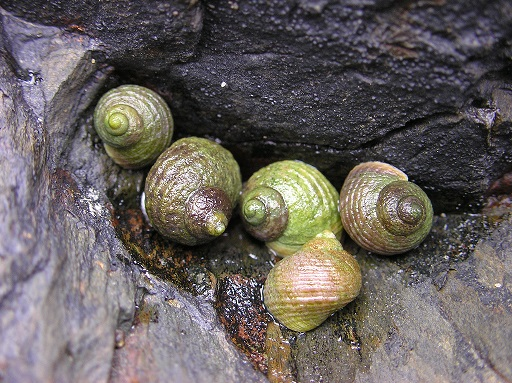
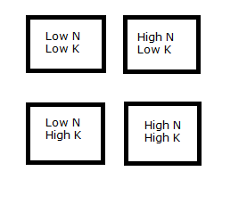

[](https://doi.org/10.5281/zenodo.4701425)  
Emma Rand. (2021). Data Analysis in R (BIO00017C) (Version v1.0). Zenodo. http://doi.org/10.5281/zenodo.4701425


```{r setup, include=FALSE}
knitr::opts_chunk$set(echo = TRUE, 
                      message = FALSE,	
                      warning = FALSE,
                      fig.width = 4, 
                      fig.height = 4, 
                      fig.retina = 3)
```

```{r include=FALSE}
library(tidyverse)
library(kableExtra)
library(RefManageR)
```

```{r, load-refs, include=FALSE, cache=FALSE}
BibOptions(check.entries = FALSE,
           bib.style = "authoryear",
           cite.style = "authoryear",
           style = "markdown",
           hyperlink = TRUE,
           dashed = FALSE,
           longnamesfirst = FALSE,
           max.names = 2)
myBib <- ReadBib("../refs/refs.bib", check = FALSE)
```

# Introduction

## Session overview

In this workshop you will get practice in applying, interpreting and reporting two-way ANOVA including the interaction term and post-hoc testing
 
## Learning Outcomes

By actively following the materials and carrying out the independent study before and after the contact hours the successful student will be able to:

-   List the sheets in, and read data from, Excel files (MLO 3)
-   Combine dataframes of the same structure (MLO 3)
-   Select, appropriately two-way ANOVA (MLO 2)
-   Understand the meaning of the interaction term
-   Apply and interpret the two-way ANOVA (including the interaction), and post-hoc tests in R (MLO 3 and 4)
-   Evaluate whether the assumptions of the test are met (MLO 2)
-   Summarise and illustrate with appropriate R figures test results scientifically (MLO 3 and 4)

## Philosophy

Workshops are not a test. It is expected that you often don't know how to start, make a lot of mistakes and need help. Do not be put off and don't let what you can not do interfere with what you can do. You will benefit from collaborating with others and/or discussing your results. It is expected that you are familiar with independent study content before the workshop. However, you need not remember or understand every detail as the workshop should build and consolidate your understanding. You may wish to refer to the independent study materials for reference.

Materials are indexed here: <https://3mmarand.github.io/BIO00017C-Data-Analysis-in-R-2020/>

## Key

These four symbols are used at the beginning of each instruction so you know where to carry out the instruction.

 is something you need to do on your computer. It may be opening programs or documents or locating a file.

 is something you should do in RStudio. It will often be typing a command or using the menus but might also be creating folders, locating or moving files.

 is something you should do in your browser on the internet. It may be searching for information, going to the VLE or downloading a file.

 is question for you to think about an answer. You will usually want to record your answers in your script for future reference.


# Getting started


 Start RStudio from the [Start menu](../pics/startmenu.png).

 Make an RStudio project for this workshop by clicking on the drop-down menu on top right where it says [Project: (None)](../pics/new-project.png) and choosing New Project and then New Directory, then New Project. Navigate to the "data-analysis-in-r" folder. Name the RStudio Project 'workshop6'.

 On the Files tab make three folders `data-raw`, `data-processed` and `figures`

 Make a [new script](../pics/newscript.png) then save it with a name like analysis.R to carry out the rest of the work.

 Load the `tidyverse`:

```{r}
library(tidyverse)
```

# Exercises

## Parasites on two species of periwinkle 

This example is about the effect of season on the parasite load of two species of periwinkle. 



A group of amateur conchologists have collected live specimens of two species of rough periwinkle (intertidal, gastropod molluscs) from sites in northern England in the Spring (1) and Summer (2). Among other variables, they take a measure of the gut parasite load.  Number of parasites is related to the number of parasites seen on a slide of gut contents and larger numbers indicate a higher parasite load. The data are in an Excel file called [periwinkle.xlsx](../data/periwinkle.xlsx). 

There's a good package for reading in Excel files, `readxl`. It is one of the [tidyverse](https://www.tidyverse.org/) packages and will be installed when you install `tidyverse` but it is not one of the core packages that get loaded with `library(tidyverse)` therefore we need to library it. I recommend putting all your library statements together at the top of the file.

 Load `readxl` with a library statement
```{r include=FALSE}
library(readxl)
```

 Save a copy of [periwinkle.xlsx](../data/periwinkle.xlsx) to your `data-raw` folder.

 Open the file in Excel so you have an understanding of its contents. 

The Excel file has two worksheets, one for the Spring data and one for the Summer data. We will need to import these individually and then combine the dataframes.

 Assign the file path to a variable called `file`:
```{r eval=FALSE}
file <- "data-raw/periwinkle.xlsx"
```

```{r echo=FALSE}
# I have a different
file <- "../data/periwinkle.xlsx"
```

We are doing this because we will use the file path three times.

<div class = "key">

**Top Tip**

Setting the file path to a variable is useful when you need to use the path several times. If you later want to apply the same process for another analysis you only need edit the one reference to the file.
</div>


`readxl` has a useful function, `excel_sheets()` for listing the sheets in an Excel workbook.

  List the sheets in the workbook:
```{r}
excel_sheets(file)
```
Now we can read in the file using one of the functions from `readxl`. Look it up in the manual `?read_excel`

 Import the data for Spring and examine its structure:
```{r }
spr <- read_excel(file, sheet = "spring")
str(spr)
```

 Now import the summer data.
```{r echo=FALSE}
#---CODING ANSWER---
sum <- read_excel(file, sheet = "summer")
```

The `tidyverse` package `dplyr` has a function called `bind_rows()` that will bind together two dataframes that have the same columns.

 Bind the two dataframes:
```{r}
periwinkle <- bind_rows(spr, sum)
```

 Examine the structure of the resulting dataframe. You can use `str()`, or another useful function is `glimpse()`
```{r echo=FALSE}
glimpse(periwinkle)
```

It's often a good idea to save a copy of your processed and now analysis-ready data and this is particularly useful if you had to do a lot of restructuring or combining to get your data in to a analysable state. We write dataframes to files using `write_delim()`

 Write the dataframe to a plain text format file in your `data-processed` folder:
```{r}
write_delim(periwinkle, "data-processed/periwinkle.txt")
```

### Exploring

 What type of variable is 'para'? What are the implications for the test? 
<!--
#---THINKING ANSWER---
it's discrete. ANOVA assumes data are normally distributed so you might feel that it is not appropriate to use ANOVA here. However, there is no easily available non-parametric equivalent for this design. In addition, there are a large number of possible values, and the difference between each value relative to the range is small so we can reasonably treat the data as continuous. We will be able to check our decision using the residuals after we have run the test.
-->

 Do a quick plot of the data. We have two explanatory variables so whilst one can be mapped to the *x*-axis as was the case for *t*-test and one-way ANOVA scenarios, the other needs to be mapped to the 'colour' or 'fill' aesthetics.

```{r}
ggplot(data = periwinkle, aes(x = season, y = para, fill = species)) +
  geom_boxplot()
```

I often use boxplots for exploratory plots. However, they are not appropriate to accompany parametric tests because they do not show the means and standard errors on which these tests are based.

You've calculated summary statistics on a response for a single explanatory several times before. Adding an additional explanatory variable is straightforward with the `group_by()` function. We just add the additional variable to the function.

 Calculate summary statistics on parasite for each species-season combination:

```{r}
perisum <- periwinkle %>% 
  group_by(season, species) %>% 
  summarise(mean = mean(para),
            median = median(para),
            sd = sd(para),
            n = length(para),
            se = sd / sqrt(n))

```
Make sure you have assigned the output as you will need it later for plotting.

Our plotting and summarising exploration gives us an idea of what we expect to find on statistical analysis.

 What three effects can we test with these data using a two-way ANOVA?
<!--
#---THINKING ANSWER---
There are three null hypotheses: 
1. there is no effect of species (i.e., no difference between species on average)
2. there is no effect of season (i.e., no difference between seasons on average) 
3. the effect of season is the same for both species (i.e., season and species act independently). 
-->

### Applying, interpreting and reporting

We now carry out a two-way ANOVA assigning the result of the `aov()` procedure to a variable and examining it with `summary()`.
We put a `*` between the explanatory variables to indicate we want to consider both factors AND the interaction.

 Create the ANOVA model with both main effects and the interaction:
```{r}
mod <- aov(data = periwinkle, para ~ season * species)
summary(mod)
```
  
 What do you conclude so far from the test? 
<!--
#---THINKING ANSWER---
You need to examine both the ANOVA table and the summary data or exploratory plot to understand the direction of the effects. 
 There was a significantly greater number of parasites in the Summer than the Spring (ANOVA: F = 25.6; d.f. = 1,96; p < 0.001). There is no difference between the species when averaged across the season but there was significant interaction (F = 6.1; d.f. = 1,96; p = 0.016) between season and species with higher numbers infecting L.nigrolineata in the Spring whilst L.saxatilis was more heavily parasitized in the Summer.
 -->

We have significant effects but which means differ? We need a post-hoc test. A post-hoc ("after this") test is done after (and only after) a significant ANOVA test. The ANOVA tells you at least two of means differ, the post-hoc test tells you where the differences are. We can use the `TukeyHSD()` in the same way as we used in for the one-way ANOVA (you may want to look back).

 Carry out a Tukey HSD.

```{r echo=FALSE}
#---CODING ANSWER---
TukeyHSD(mod)
```

Note that long names for group combinations means that the output wraps. You may want to increase the size of your console window to see to output unwrapped.

We have three bits of output, eaching corresponding to the three null hypotheses. There is a significant difference between the season with a difference between the means of 11.1 parasites. We then have significant comparisons between: Spring and Summer for *L. saxatilis*; *L.nigrolineata* in the Summer and *L.saxatilis* in the Spring; *L.nigrolineata* in Spring and *L.saxatilis* in Summer.


### Checking selection

 Check the assumptions of the test by looking at the distribution of the 'residuals'. You may want to look at last week's script.
```{r include=FALSE}
#---CODING AND THINKING ANSWER---
plot(mod, which = 1)
# the variance is similar across the values of para
hist(mod$residuals)
# maybe a little skew (tail to the right) but IMO fairly symmetrical
shapiro.test(mod$residuals)
# and the distribution is not significantly difference from the normal distribution. As there are 100 values, we can be reasonably confident that an NS means there is not difference rather than we just don't have enough data to detect one.
```

 What do you conclude about the test assumptions?

<!-- THINKING ANSWER
the variance is similar across the values of para -->
<!-- maybe a little skew (tail to the right) but IMO fairly symmetrical -->
<!-- and the distribution is not significantly difference from the normal distribution. As there are 100 values, we can be reasonably confident that an NS means there is not difference rather than we just don't have enough data to detect one. -->
<!-- Overall, it looks like the assumptions are met -->


### Illustrating

Producing a figure to go with this result using `ggplot2`.
We will again need the means and standard errors calculated earlier and stored in `perisum`

We are going to create a figure like this:

```{r echo=FALSE, fig.height=5, fig.width=6}

ggplot() +
  geom_point(data = periwinkle, 
             aes(x = season, y = para, shape = species),
             position = position_jitterdodge(dodge.width = 1,
                                             jitter.width = 0.3,
                                             jitter.height = 0),
             colour = "gray50") +
  geom_errorbar(data = perisum, 
                aes(x = season, 
                    ymin = mean - se, 
                    ymax = mean + se,
                    group = species),
                width = 0.4, 
                position = position_dodge(width = 1)) +
  geom_errorbar(data = perisum, 
                aes(x = season, 
                    ymin = mean,
                    ymax = mean, 
                    group = species),
                width = 0.3, 
                size = 1,
                position = position_dodge(width = 1) ) +
  scale_y_continuous(name = "Number of parasites",
                     expand = c(0, 0),
                     limits = c(0, 130)) +
  scale_x_discrete(name = "Season") +
  theme_classic() +
  theme(legend.title = element_blank(),
        legend.position = c(0.2, 0.95))

```

Figure 1. The effect of season on the parasite load in two species of periwinkle. Thick lines give the means and error bars are $\pm$ 1 S.E. 


We will plot the means and error bars. Look this up in the [Oneway ANOVA workshop](05OnewayANOVAandKruskalWallis.html). 

  Let's try doing the same here:

```{r fig.height=5, fig.width=5}
ggplot() +
  geom_point(data = periwinkle, 
             aes(x = season, y = para),
             position = position_jitter(width = 0.3,
                                        height = 0),
             colour = "gray50") +
  geom_errorbar(data = perisum, 
                aes(x = season, 
                    ymin = mean - se, 
                    ymax = mean + se),
                width = 0.4, 
                position = position_dodge(width = 1)) +
  geom_errorbar(data = perisum, 
                aes(x = season, 
                    ymin = mean,
                    ymax = mean),
                width = 0.3, 
                size = 1)
  
```

How can we show the species separately? 

  We can map the species variable to the shape aesthetic!
```{r fig.height=5, fig.width=6}

ggplot() +
  geom_point(data = periwinkle,
             aes(x = season, y = para, shape = species),
             position = position_jitter(width = 0.3, 
                                        height = 0),
             colour = "gray50") +
  geom_errorbar(data = perisum, 
                aes(x = season, 
                    ymin = mean - se,
                    ymax = mean + se),
                width = 0.4, size = 1) +
  geom_errorbar(data = perisum, 
                aes(x = season,
                    ymin = mean,
                    ymax = mean),
                width = 0.3, 
                size = 1)
  
```

Oh, that isn't quite what we want! We want the species side-by-side, not on top of each other.

  We can achieve that by using setting the `position` argument to  `position_jitterdodge()` in the `geom_point()` and to `position_dodge()` in the two `geom_errorbar()`. We also have to specify that the error bars are grouped by species since they are not otherwise mapped to a shape, colour or fill.

```{r fig.height=5, fig.width=6}
ggplot() +
  geom_point(data = periwinkle, 
             aes(x = season, y = para, shape = species),
             position = position_jitterdodge(dodge.width = 1,
                                             jitter.width = 0.3,
                                             jitter.height = 0),
             colour = "gray50") +
  geom_errorbar(data = perisum, 
                aes(x = season, 
                    ymin = mean - se, 
                    ymax = mean + se,
                    group = species),
                width = 0.4, 
                position = position_dodge(width = 1)) +
  geom_errorbar(data = perisum, 
                aes(x = season, 
                    ymin = mean,
                    ymax = mean, 
                    group = species),
                width = 0.3, 
                size = 1,
                position = position_dodge(width = 1) ) 

  
```


 Finally we add axis labels, specify the *y*-axis limits and add `theme_classic()`. I've also altered the legend position and got rid of the legend title.


```{r fig.height=5, fig.width=6}
ggplot() +
  geom_point(data = periwinkle, 
             aes(x = season, y = para, shape = species),
             position = position_jitterdodge(dodge.width = 1,
                                             jitter.width = 0.3,
                                             jitter.height = 0),
             colour = "gray50") +
  geom_errorbar(data = perisum, 
                aes(x = season, 
                    ymin = mean - se, 
                    ymax = mean + se,
                    group = species),
                width = 0.4, 
                position = position_dodge(width = 1)) +
  geom_errorbar(data = perisum, 
                aes(x = season, 
                    ymin = mean,
                    ymax = mean, 
                    group = species),
                width = 0.3, 
                size = 1,
                position = position_dodge(width = 1) ) +
  scale_y_continuous(name = "Number of parasites",
                     expand = c(0, 0),
                     limits = c(0, 130)) +
  scale_x_discrete(name = "Season") +
  theme_classic() +
  theme(legend.title = element_blank(),
        legend.position = c(0.2, 0.95))
```

We are nearly there!

 Now you add the annotation for the post-hoc result. You may want to look up [last week's workshop](06One-wayAnovaAndKW.html).

```{r include = FALSE, results = 'hide', fig.height=5, fig.width=6}

# the signifcant comparisons are                           p adj
# Summer: saxatilis-Spring: saxatilis    0.0000041
# Summer: nigrolineata-Spring: saxatilis 0.0003558
# Spring: nigrolineata-Summer: saxatilis 0.0198124
perfig <- ggplot() +
  geom_point(data = periwinkle, 
             aes(x = season, y = para, shape = species),
             position = position_jitterdodge(dodge.width = 1,
                                             jitter.width = 0.3,
                                             jitter.height = 0),
             colour = "gray50") +
  geom_errorbar(data = perisum, 
                aes(x = season, 
                    ymin = mean - se, 
                    ymax = mean + se,
                    group = species),
                width = 0.4, 
                position = position_dodge(width = 1)) +
  geom_errorbar(data = perisum, 
                aes(x = season, 
                    ymin = mean,
                    ymax = mean, 
                    group = species),
                width = 0.3, 
                size = 1,
                position = position_dodge(width = 1) ) +
  scale_y_continuous(name = "Number of parasites",
                     expand = c(0, 0),
                     limits = c(0, 140)) +
  scale_x_discrete(name = "Season") +
  # Summer: nigrolineata-Spring: saxatilis 0.0003558
  annotate("segment", 
           x = 1.25, xend = 1.75, 
           y = 112, yend = 112,
           colour = "black") +
  annotate("segment", 
           x = 1.25, xend = 1.25,
           y = 112, yend = 110,
           colour = "black") +
  annotate("segment", 
           x = 1.75, xend = 1.75,
           y = 112, yend = 110,
           colour = "black") +
  annotate("text", 
           x = 1.5,  y = 114,
           label = "***", size = 6) +
  # Spring: nigrolineata-Summer: saxatilis 0.0198124
  annotate("segment", 
           x = 1.75, xend = 0.75,
           y = 104, yend = 104,
           colour = "black") +
  annotate("segment", 
           x = 1.75, xend = 1.75,
           y = 104, yend = 102,
           colour = "black") +
  annotate("segment", 
           x = 0.75, xend = 0.75,
           y = 104, yend = 102,
           colour = "black") +
  annotate("text", x = 1.25,  y = 106,
           label = "*", size = 6) +
# Summer: saxatilis-Spring: saxatilis    0.0000041
  annotate("segment",
           x = 1.25, xend = 2.25,
           y = 120, yend = 120,
           colour = "black") +
  annotate("segment",
           x = 1.25, xend = 1.25,
           y = 120, yend = 118,
           colour = "black") +
  annotate("segment",
           x = 2.25, xend = 2.25,
           y = 120, yend = 118,
           colour = "black") +
  annotate("text", x = 1.75,  y = 122,
           label = "***", size = 6) +
  theme_classic() +
  theme(legend.title = element_blank(),
        legend.position = c(0.8, 0.95))
```

 Use `ggsave()` to save your figure to the `figures` folder

```{r echo = FALSE}
ggsave("figures/periwinkle.tif",
       plot = perfig,
       device = "tiff",
       width = 5,
       height = 4,
       units = "in",
       dpi = 300)
# or
ggsave("figures/periwinkle.png",
       plot = perfig,
       device = "png",
       width = 5,
       height = 4,
       units = "in",
       dpi = 300)

```


# `r emo::ji("party")` Well Done! `r emo::ji("party")`

# Independent study following the workshop

## 1. Fertilising a crop with Nitrogen and Potassium

The STATA file [yield.xlsx](../data/yield.xlsx) contains data from a two-factor design in which crop yield (in kilograms) was determined from plots treated with low and high levels of nitrogen and low and high levels of potassium (see the image). Analyse these data as you see fit and write up the results including some appropriate figures and/or tables. 




```{r, include=FALSE, results='hide'}
#---CODING AND THINKING ANSWER---
# import the data 
# note - if you structured as directed, your path will be data-raw/yield.xlsx
file <- "../data/yield.xlsx"
excel_sheets(file)
low_low <- read_excel(file, sheet = "low-low")
high_low <- read_excel(file, sheet = "high-low")
low_high <- read_excel(file, sheet = "low-high")
high_high <- read_excel(file, sheet = "high-high")
yield <- bind_rows(low_low, high_low, low_high, high_high)

glimpse(yield)

# looking at the dataset there doesn't seem to be anything very obviously non-normal (such as lots of values the same, too many zeros, or extreme values)
# we will check the assumptions after we have run the anova

# Do a rough plot of the data
ggplot(data = yield, aes(x = nitrogen, y = kg, fill = potassium)) +
  geom_boxplot()


#a summary of the data (means and se) is useful both to help us understand the data and for plotting later
yieldsum <- yield %>% 
  group_by(nitrogen, potassium) %>% 
  summarise(mean = mean(kg),
            median = median(kg),
            sd = sd(kg),
            n = length(kg),
            se = sd/sqrt(n))
# # A tibble: 4 x 7
# # Groups:   nitrogen [2]
#   nitrogen potassium  mean median    sd     n    se
#   <chr>    <chr>     <dbl>  <dbl> <dbl> <int> <dbl>
# 1 high     high      21.0   21.8   3.75    10  1.19
# 2 high     low       15.6   16.4   3.74    10  1.18
# 3 low      high      16.5   16.0   5.26    10  1.66
# 4 low      low        9.72   9.93  4.29    10  1.36


# build the anova model
mod <- aov(data = yield, kg ~ nitrogen * potassium)
summary(mod)

#                    Df Sum Sq Mean Sq F value   Pr(>F)    
# nitrogen            1  273.2   273.2  14.741  0.00048 ***
# potassium           1  369.7   369.7  19.945 7.58e-05 ***
# nitrogen:potassium  1    4.3     4.3   0.232  0.63283    
# Residuals          36  667.2    18.5    
 # There was a significantly greater yield at high nitrogen than at low nitrogen (ANOVA: F = 14.7; d.f. = 1,36; p < 0.001) and at high potassium than at low potassium (F = 19.9; d.f. = 1,36; p < 0.001). These effects were independent.

# check the assumptions
plot(mod, which = 1)
hist(mod$residuals)
shapiro.test(mod$residuals)
# the variance is a bit lower in the group with the highest mean
# and the histogram has a bit of bump at the low end but it looks ok

 
# it is questionable whether we really need a post-hoc test as
# the effect of nitrogen must be between high and low and the 
# effect of potassium must be between high and low (there are only two
# categories in each explanatory) and there is no interaction.
# However, lets do one any way
TukeyHSD(mod) 

# $`Nitrogen:Potassium`
#                      diff        lwr       upr     p adj
# high:low-low:low    5.883  0.6976609 11.068339 0.0209708
# low:high-low:low    6.736  1.5506609 11.921339 0.0066292
# high:high-low:low  11.307  6.1216609 16.492339 0.0000060
# low:high-high:low   0.853 -4.3323391  6.038339 0.9705373
# high:high-high:low  5.424  0.2386609 10.609339 0.0374574
# high:high-low:high  4.571 -0.6143391  9.756339 0.1004742
# All means differ except
#   low N:high K - high N:low K  p = 0.9705373 (red and blue boxes in the middle)
#   high N:high K - low N:high K p = 0.1004742 (the two blue boxes).
# In this situation, I might label those means that do NOT differ with the same letter code
# rather than adding a lot of lines indicating significance.

# figure
ggplot() +
  geom_point(data = yield, 
             aes(x = nitrogen, y = kg, shape = potassium),
             position = position_jitterdodge(dodge.width = 1,
                                             jitter.width = 0.25,
                                             jitter.height = 0),
             colour = "black", 
             size = 2) +
  geom_errorbar(data = yieldsum, 
                aes(x = nitrogen, 
                    ymin = mean - se,
                    ymax = mean + se,
                    group = potassium),
                width = 0.4, size = 1,
                position = position_dodge(width = 1)) +
  geom_errorbar(data = yieldsum, 
                aes(x = nitrogen, 
                    ymin = mean, 
                    ymax = mean, 
                    group = potassium),
                width = 0.3, size = 1,
                position = position_dodge(width = 1) ) +
  scale_y_continuous(name = "Yield (kg)", 
                     limits = c(0, 40),
                     expand = c(0, 0)) +
  scale_x_discrete(name = "Nitrogen", 
                   labels = c("High", "Low")) +
  scale_shape_discrete(name = "Potassium", 
                   labels = c("High", "Low"),
                   solid = FALSE) +
  annotate("text", x = 1.25,  y = 5,
           label = "a", size = 5) +
  annotate("text", x = 1.75,  y = 5,
           label = "a", size = 5) +
  annotate("text", x = 1.25,  y = 3,
           label = "b", size = 5) +
  annotate("text", x = 2.25,  y = 3,
           label = "b", size = 5) +
  theme_classic() +
  theme(legend.position = c(0.2, 0.9))

```


# The Code files

These contain all the code needed in the workshop even where it is not visible on the webpage.

[Rmd file](06Two-wayAnova.Rmd) The Rmd file is the file I use to compile the practical. Rmd stands for R markdown. It allows R code and ordinary text to be interweaved to produce well-formatted reports including webpages. If you right-click on the link and choose Save-As, you will be able to open the Rmd file in RStudio. Alternatively, [View in Browser](https://github.com/3mmaRand/BIO00017C-Data-Analysis-in-R-2020/blob/main/workshops/06Two-wayAnova.Rmd).

[Plain script file](../scripts/06Two-wayAnova.R) This is plain script (.R) version of the practical generated from the Rmd. Again, you can save this and open it RStudio. Alternatively, [View in Browser](https://github.com/3mmaRand/BIO00017C-Data-Analysis-in-R-2020/blob/main/scripts/06Two-wayAnova.R).

Pages made with `rmarkdown` `r Cite(myBib, c("markdown1","markdown2"))`, `kableExtra` `r Cite(myBib, "kableExtra")`, `RefManager` `r Cite(myBib, "RefManager")`

# References

```{r refs, echo=FALSE, results="asis"}
PrintBibliography(myBib)  
```

# Please cite as:

Emma Rand. (2021). Data Analysis in R (BIO00017C) (Version v1.0). Zenodo. http://doi.org/10.5281/zenodo.4701425


